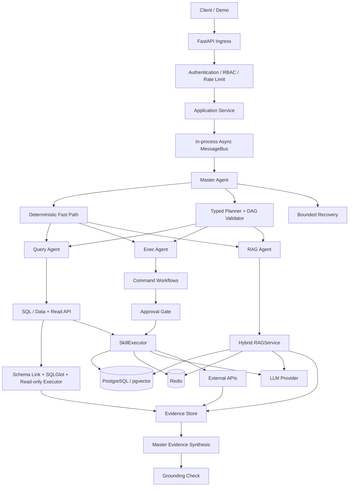

# Enterprise Data Agent

## Multi-Agent RAG & Text-to-SQL Platform

[](https://github.com/wz13814990585-sudo/ecom_agent_matrix/actions/workflows/ci.yml)


> 面向跨境电商运营的 typed、fail-closed Enterprise Data Agent。
>
> A production-inspired agent runtime with deterministic routing, validated DAG execution, hybrid RAG, tenant isolation, human approval, and measurable safety.

本项目回答一个核心问题：**当企业用户的复杂业务问题同时涉及结构化数据库、内部文档和业务系统时，Agent 能否安全、准确、可追溯地收集证据并返回 grounded answer？**

系统只注册四个 Runtime Agent。库存、广告、风控、客服、报表等业务能力由 typed Workflow 与 Skill 承载，避免演变成难以治理的“一个功能一个 Agent”。

## 核心亮点

| 能力 | 实现 |
|---|---|
| 确定性 Fast Path | 高置信单任务不调用 Planner，直接路由到目标 Agent |
| Typed DAG | 复杂任务经过步骤上限、依赖、环路和 Agent/task mapping 校验 |
| Fail-closed 执行 | 未认证身份、越权 Skill、无效审批和不可用 Agent 均显式失败 |
| Human-in-the-loop | 高风险写操作绑定租户、Skill、精确参数哈希、有效期和一次性消费 |
| Hybrid RAG | Vector + lexical recall、RRF、batch rerank、citation validation |
| Safe Text-to-SQL | 权限前置 Schema Linking、结构化生成、SQLGlot AST 校验、只读执行 |
| Query Guard | 表/列白名单、租户 scope、JOIN/列/行上限、statement timeout |
| SQL Lineage | claim 可追溯到 query ID、SQL、表/列、行数、截断与执行延迟 |
| Unified Evidence | SQL / Document / API / Computed 统一证据模型与请求内 EvidenceStore |
| Joint Analysis | Query + RAG 并行取证，Master 分析服务区分事实、相关性、假设与未知 |
| Business API Tools | Query 读适配器与 Exec 受保护写适配器（当前为明确标记的 demo provider） |
| 多租户隔离 | SecurityContext、PostgreSQL RLS、cache、memory、approval 全链路携带 scope |
| 可观测性 | 结构化日志、Prometheus 指标、task/correlation tracing、真实 LLM usage |
| 系统化评估 | Routing、Planning、Safety、Recovery、Execution、RAG 独立评估与报告 |

## 当前验证状态

当前分支已通过：

- 458 个自动化测试（最终数量以当前 `pytest -q` 为准）
- Ruff lint 与 format gate
- Python compileall
- 13/13 deterministic routing cases
- 6/6 typed planning cases
- 16/16 safety cases
- 50/50 Enterprise Data Agent deterministic benchmark cases
- Docker Compose 配置校验

最新评估输出见 [Agent report](eval/results/latest.json) 和 [Enterprise report](eval/enterprise/results/latest.json)。依赖真实 API、数据库执行或已填充向量索引的指标会明确显示 `NOT_RUN`。

## 系统架构



主执行链路：

```text
HTTP API
  -> Application Service
  -> Master Orchestrator
  -> Fast Path / Typed Planner
  -> Validated DAG Executor
  -> Query / Exec / RAG
  -> Typed Workflow
  -> SkillExecutor
  -> Security / Approval / Idempotency
  -> Infrastructure
```

### 四个 Agent 的职责

| Agent | 职责 | 安全边界 |
|---|---|---|
| Master | 路由、规划、DAG 调度、证据聚合、分析综合、有限恢复 | 不直接执行业务 Skill |
| Query | Text-to-SQL、结构化分析、商品/订单/库存查询、业务 API 读 | 只运行只读能力 |
| Exec | 广告优化、风控、报表、社媒和客服产物 | 高风险副作用必须经过审批 |
| RAG | 店铺政策、FAQ、运营知识与商品知识 | 统一进入 `RAGService` |

更多时序图见 [Architecture](docs/architecture.md)。

## Enterprise SQL pipeline

```text
Question -> permission-filtered Schema Catalog -> Hybrid Schema Linking
         -> structured SQL generation -> SQLGlot parse/AST validation
         -> table/column/cost/tenant guards -> read-only transaction + RLS
         -> result-quality validation -> optional one-shot repair
         -> SQL evidence + lineage
```

Schema Catalog 在启动时加载并缓存，只在显式 refresh 时更新；每次请求不会把整个 `information_schema` 丢给 LLM。生成 SQL 仅能看到用户当前可访问且与问题相关的表、列、关系和指标定义。

## 为什么同时使用 Fast Path 和 Typed DAG？

简单且高置信的请求走确定性 Fast Path，减少 Planner latency、token cost 和路由随机性。真正的组合任务才进入 Planner，并且模型输出必须先通过 typed policy validation，不能直接成为执行指令。

ReAct 只用于有界恢复，不是默认执行模式。写操作不会因为模型建议而盲目重试。Clarification 被视为成功的控制面交互；超时、Agent 不可用、部分完成和等待审批不会计为完整业务成功。

## 安全与人工审批

代码负责认证、授权、审批和执行状态；LLM 只负责不确定规划与语言生成。

高风险操作遵循以下状态流：

```text
risky request
  -> protected Skill
  -> no valid approval
  -> success=false
  -> status=awaiting_approval
  -> error_code=APPROVAL_REQUIRED
  -> authenticated approval of exact parameters
  -> consume approval once
  -> execute side effect once
```

审批绑定 tenant、store、requester、Skill 和精确参数哈希，并具有过期时间与一次性消费语义。用户 payload 或 LLM 输出不能伪造 `SecurityContext`，也不能自行批准写操作。

## Hybrid RAG

`RAGService` 独立执行 vector 与 lexical recall，通过 Reciprocal Rank Fusion 合并候选，只进行一次 bounded batch rerank，随后验证 citation 与 grounding 状态。

当 LLM 不可用时，系统可以返回确定性的 source-context fallback；当某个召回通道失败时，会报告 degraded retrieval，而不是伪装成完整成功。统一评估保留 HitRate、Recall、MRR 和 nDCG，不使用未经运行的数据做质量宣传。

## 快速启动

### 方案 A：Docker Compose

要求：Docker 与 Docker Compose。

```bash
cp .env.example .env
# 编辑 .env，至少设置 API_KEY 和 PostgreSQL 密码

docker compose -f ecom_agent_matrix/docker/docker-compose.yml up --build -d
curl http://127.0.0.1:8000/health
curl http://127.0.0.1:8000/health/ready
```

启动后可访问：

- Swagger UI：<http://127.0.0.1:8000/docs>
- ReDoc：<http://127.0.0.1:8000/redoc>
- Health：<http://127.0.0.1:8000/health>
- Readiness：<http://127.0.0.1:8000/health/ready>
- Metrics：<http://127.0.0.1:8000/metrics>

默认镜像是 lean API runtime，不包含 Torch/SentenceTransformer。需要完整本地 RAG Demo 时显式构建 `rag-local` 镜像：

```bash
INSTALL_RAG_LOCAL=1 docker compose \
  -f ecom_agent_matrix/docker/docker-compose.yml up --build -d

docker compose -f ecom_agent_matrix/docker/docker-compose.yml exec api \
  python -m ecom_agent_matrix.scripts.reembed_vectors --only goods
```

第一次生成向量可能下载 `BAAI/bge-small-en-v1.5`。PostgreSQL 初始化 SQL 只会在数据卷为空时自动执行；应用启动不会静默修改已有生产数据库。

### 方案 B：本地 Python

要求：Python 3.11+、Redis 7、PostgreSQL 16 与 `pgvector`。

```bash
python -m venv .venv
source .venv/bin/activate
pip install -e ".[dev]"
cp .env.example .env
```

如需本地 embedding/reranking：

```bash
pip install -e ".[rag-local]"
```

初始化数据库并启动 API：

```bash
python -m ecom_agent_matrix.scripts.init_db
python -m ecom_agent_matrix.scripts.reembed_vectors --only goods  # 仅完整 RAG Demo 需要
uvicorn ecom_agent_matrix.api.main:app --host 0.0.0.0 --port 8000
```

## 最小 API 示例

```bash
curl -sS http://127.0.0.1:8000/api/v1/tasks \
  -H "Content-Type: application/json" \
  -H "X-API-Key: your-local-demo-key" \
  -d '{
    "query": "搜索防水户外背包",
    "task_type": "goods_search",
    "payload": {"sku": "SKU-BAG-001"}
  }'
```

完整的四条演示路径：

1. Simple Query Fast Path
2. Knowledge RAG
3. Composite Typed DAG
4. Risk Approval

可复制请求、审批 header 和响应字段说明见 [Demo guide](docs/demo.md)。也可以运行 smoke runner：

```bash
export DEMO_API_KEY=your-local-demo-key
python -m ecom_agent_matrix.scripts.smoke_e2e --transport http --mode fast-path --api-key "$DEMO_API_KEY"
python -m ecom_agent_matrix.scripts.smoke_e2e --transport http --mode rag --api-key "$DEMO_API_KEY"
python -m ecom_agent_matrix.scripts.smoke_e2e --transport http --mode composite --api-key "$DEMO_API_KEY"
python -m ecom_agent_matrix.scripts.smoke_e2e --transport http --mode risk --api-key "$DEMO_API_KEY"
```

## Agent Evaluation

pytest 验证代码正确性；Evaluation Harness 衡量 Agent 的可观察行为。

```bash
python -m eval.runner --suite routing
python -m eval.runner --suite deterministic --fail-on-regression
python -m eval.runner --suite all
python -m eval.enterprise.runner --suite all --fail-on-regression
```

评估维度：

- Routing：accuracy、Fast Path precision/recall、clarification、无效路由
- Planning：parse、policy validity、cycle、dependency、Agent/task mapping
- Execution：task/workflow/Skill success、timeout、latency、LLM usage 与 cost
- Safety：越权执行、审批合规、重复副作用和租户隔离
- Recovery：有界恢复、degraded success、unsafe retry、recovery LLM calls
- RAG：HitRate、Recall、MRR、nDCG、citation validity 与 grounding
- SQL：parse/safety pass、table/column precision/recall、unsafe SQL rate
- Enterprise：SQL、RAG、SQL+RAG、API、permission 与 safety 共 50 个用例

报告写入 `eval/results/latest.json` 和 `eval/results/latest.md`，并严格区分 `PASS`、`FAIL`、`DEGRADED` 与 `NOT_RUN`。

## 开发与质量门

```bash
python -m compileall -q ecom_agent_matrix eval
ruff check ecom_agent_matrix test eval
ruff format --check ecom_agent_matrix test eval
pytest -q
python -m eval.runner --suite deterministic --fail-on-regression
python -m eval.enterprise.runner --suite all --fail-on-regression
```

默认 CI 不下载 embedding/CrossEncoder 模型，也不依赖外部 API、PostgreSQL 或 Redis 集成环境。

确定性 routing benchmark 可单独运行，但它不是端到端性能测试：

```bash
python -m ecom_agent_matrix.scripts.benchmark_demo -n 100
```

## 项目结构

```text
ecom_agent_matrix/
  api/                 FastAPI ingress and schemas
  application/         HTTP-independent application boundary
  agents/              four runtime Agent adapters
  orchestration/       routing, typed planning, DAG execution, recovery
  runtime/             lifecycle and in-process async messaging
  workflows/           typed business orchestration
  core/                task, security, Skill, approval, LLM contracts
  infrastructure/      database, Redis, LLM, embedding adapters
  modules/             data intelligence, evidence, business API, Skills, and RAG
  platform/            observability and resilience
  db/                  schemas, RLS migration, database clients
  scripts/             initialization, indexing, smoke, benchmark
  docker/              local demo image and Compose environment
test/                   correctness, contract, security, architecture tests
eval/                   behavior cases, evaluator, CLI, reports
docs/                   architecture, demo, observability, interview notes
```

## 有意保留的架构取舍

- MessageBus 是单进程 asyncio transport，适合当前作品集与 Demo 规模。
- 不声称已经实现 Kafka、RabbitMQ、Celery 或分布式一致性。
- 不引入 LangChain、LangGraph、CrewAI 或 AutoGen；核心约束由 typed Python contracts 表达。
- 全局 singleton 仅作为旧调用兼容入口；活动 Runtime 由 `AppRuntime` 持有并注入依赖。
- 只有在测量结果证明需要时，才引入 durable transport 或拆分进程。

## 当前限制

- MessageBus、rate limiter、circuit breaker 和 reply registry 是进程内状态。
- 默认 Docker 镜像不包含本地 Transformer 模型。
- 完整 RAG 质量评估需要真实填充的向量索引与 ranked results。
- Enterprise benchmark 的 SQL execution accuracy 需要真实 PostgreSQL seeded dataset；当前报告为 `NOT_RUN`。
- Business API provider 当前是本地 demo adapter，不声称已连接生产电商平台。
- 生产部署仍需要 managed secrets、正式数据库角色/迁移、SLO 和部署平台配置。
- 仓库不包含虚构的 CD 或未经测量的吞吐量、准确率与成本声明。

## 延伸阅读

- [Architecture](docs/architecture.md) — Fast Path、Typed DAG、Risk Approval 时序
- [Demo guide](docs/demo.md) — 四条可复制演示路径
- [Observability](docs/observability.md) — 日志、指标与 tracing
- [Interview notes](docs/interview_notes.md) — 架构取舍与常见面试问答
