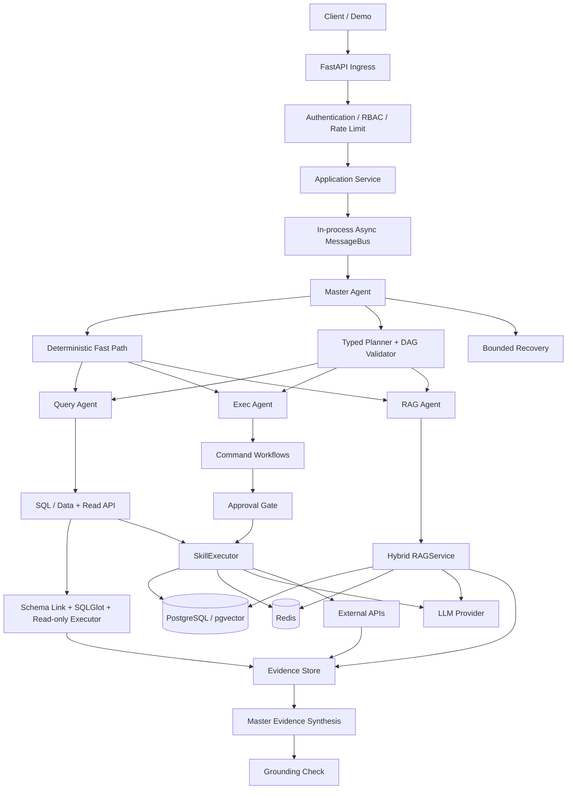

# Cross-Border E-commerce Multi-Agent Operations Platform

[简体中文](README.md) | [English](README_EN.md)

## A safe, explainable, locally runnable RAG and Text-to-SQL operations platform

[](https://github.com/wz13814990585-sudo/EcomPilot/actions/workflows/ci.yml)


> An enterprise-inspired agent system for cross-border e-commerce operations. It brings sales analytics, products and inventory, competitor monitoring, knowledge-base Q&A, customer service, social copy, and high-risk approvals into one natural-language interface. Deterministic routing, constrained DAG execution, tenant isolation, and human approval keep execution safe.

[Highlights](#core-highlights) · [Quick demo](#run-the-complete-local-demo-in-5-minutes) · [Example questions](#questions-you-can-ask) · [Architecture](#system-architecture) · [Evaluation](#current-validation-status) · [Contributing](CONTRIBUTING_EN.md)

## What can it do?

| Scenario | User experience | System capability |
|---|---|---|
| Sales and refund analytics | Ask for revenue, refund rates, and likely drivers directly | Safe Text-to-SQL plus joint SQL/RAG evidence |
| Products, prices, and inventory | Ask for shoe or backpack prices, stock, and replenishment advice | Product search, stock prediction, and follow-up memory |
| Competitor monitoring | Compare prices across Temu, Amazon, and other channels | Multi-platform price observations and alerts |
| Store knowledge Q&A | Ask about returns, shipping, warranties, and operating policies | Hybrid RAG, citation validation, and grounded answers |
| Marketing content | Generate promotional copy for TikTok and other platforms | Platform-aware templates, brand voice, and multilingual output |
| Customer-service assistance | Draft replies using product, order, and policy context | CRM short-term memory, RAG, and human-readable responses |
| High-risk actions | Approve campaign pauses, order risk flags, and other writes | Parameter-bound approval, one-time consumption, and idempotency |
| Data administration | Maintain products and RAG documents in the admin console | RBAC, tenant isolation, and visual CRUD tools |

Short-term memory is preserved within a conversation, so users can follow up with “How much is it?” or “What about the stock?”. Starting a new conversation clears messages, approval context, and conversation memory together.

## Run the complete local demo in 5 minutes

The primary interface is natural-language chat. Normal use does not require selecting a `task_type`, writing SQL, or providing JSON.

```bash
python -m venv .venv
source .venv/bin/activate
pip install -e ".[dev]"
cp .env.example .env
```

At minimum, configure a local PostgreSQL password and a demo API key in `.env`:

```dotenv
APP_ENV=development
AUTH_MODE=api_key
API_KEY=replace-with-a-local-demo-key
PG_HOST=127.0.0.1
PG_PORT=5432
PG_DB=ecom_matrix
PG_USER=postgres
PG_PWD=replace-with-local-postgres-password
REDIS_HOST=127.0.0.1
REDIS_PORT=6379
```

Start PostgreSQL 16 with pgvector and Redis 7, then install the repeatable demo dataset:

```bash
python -m ecom_agent_matrix.scripts.bootstrap_demo
python -m uvicorn ecom_agent_matrix.api.main:app --reload --port 8002
```

Open <http://127.0.0.1:8002/app>, enter the API key, and ask a question. The bootstrap creates 52 products, 720 orders covering January–September 2026, 160 competitor observations, 12 risk records, and 30 knowledge documents. Without local embedding dependencies, retrieval explicitly runs in `lexical_only` mode. To enable hybrid retrieval:

```bash
pip install -e ".[rag-local]"
python -m ecom_agent_matrix.scripts.bootstrap_demo --with-embeddings
```

An LLM is optional. Clear intents, SQL templates, RAG retrieval, and presentation all have deterministic fallbacks. For more natural synthesis, set an existing `DEEPSEEK_API_KEY` or `OPENAI_API_KEY` in `.env` without changing the architecture.

Users with the `admin` role can open the admin console from the left navigation. They can view business-data summaries, search/create/edit/delete products, and inspect or maintain RAG documents. Every admin API enforces the role on the server and remains isolated by tenant/store RLS; a hidden front-end button cannot bypass authorization.

## Questions you can ask

- `What was the revenue in August 2026?`
- `Why did the refund rate increase in August 2026? Were there related operating incidents?`
- `What is the return policy?`
- `Find me a waterproof outdoor backpack.`
- `What products are currently in the store?`
- `Which products are low on stock and should be replenished first?`
- `What is the latest Temu price for BAG-001?`
- `What is the current status of ORD-DEMO-001?`
- `Which advertising campaign has the lowest ROAS?`
- `Pause the worst-performing advertising campaign.` (approval required)
- `Check the current e-commerce data for anomalies.`
- `Generate today's operations report.`
- `Write TikTok promotional copy for BAG-001.`
- `A customer says the BAG-002 zipper is broken and wants a refund. How should we reply?`
- `Mark ORD-DEMO-RISK as a high-risk order.` (approval required)

See the [demo capability matrix](docs/demo_capability_matrix.md) for the real backend mapping behind every entry point.

The project addresses one central question: **when an enterprise request spans structured databases, internal documents, and business systems, can an Agent collect evidence and return a safe, accurate, and traceable grounded answer?**

Only four Runtime Agents are registered. Inventory, advertising, risk control, customer service, and reporting are implemented as typed Workflows and Skills, avoiding an ungovernable “one Agent per feature” design.

## Core highlights

| Capability | Implementation |
|---|---|
| Deterministic Fast Path | High-confidence single tasks skip the Planner and route directly to the target Agent |
| Typed DAG | Composite tasks validate step limits, dependencies, cycles, and Agent/task mappings |
| Fail-closed execution | Unauthenticated identities, unauthorized Skills, invalid approvals, and unavailable Agents fail explicitly |
| Human in the loop | High-risk writes bind tenant, Skill, exact parameter hash, expiry, and one-time consumption |
| Hybrid RAG | Vector and lexical recall, RRF, bounded batch reranking, and citation validation |
| Safe Text-to-SQL | Permission-first Schema Linking, function allowlist, SQLGlot AST validation, and read-only execution |
| Query Guard | Table/column allowlists, tenant scope, JOIN/column/row limits, and statement timeout |
| SQL Lineage | Claims trace back to query ID, SQL, tables/columns, row count, truncation, and latency |
| Unified Evidence | SQL, Document, API, and Computed evidence share one request-scoped EvidenceStore |
| Analytical Planning | Query performs bounded multi-SQL decomposition for trend/category/SKU analysis |
| Joint Analysis | Query and RAG gather evidence in parallel and distinguish facts, co-occurrence, correlation, hypotheses, and unknowns |
| Business API Tools | Query uses read adapters; Exec uses protected write adapters; current providers are clearly labeled demos |
| Multi-tenant isolation | SecurityContext, PostgreSQL RLS, cache, memory, and approval all carry trusted scope |
| Observability | Structured logs, Prometheus metrics, task/correlation tracing, and real LLM usage |
| Systematic evaluation | Routing, Planning, Safety, Recovery, Execution, RAG, and SQL are evaluated independently |

## Current validation status

The current branch passes:

- 526 automated tests, continuously verified by GitHub Actions
- Ruff lint and formatting gates
- Python compileall
- 13/13 deterministic routing cases
- 6/6 typed planning cases
- 16/16 safety cases
- 50/50 deterministic Enterprise Data Agent benchmark cases
- 16/16 Schema Linking, 6/6 Analytical Plan, 35/35 adversarial SQL Safety, and 3/3 Evidence cases
- 32/32 Gold SQL execution cases through validator, PostgreSQL, and comparator
- 6/6 deterministic Question-to-SQL execution cases through the production service
- Live PostgreSQL Schema Discovery, tenant RLS, read-only role, SQL Repair, and Analytical Evidence integration tests
- Docker Compose configuration validation

Latest reports: [Agent report](eval/results/latest.json), [Enterprise report](eval/enterprise/results/latest.json), [Gold SQL report](eval/enterprise/results/sql_gold_execution.json), [Question-to-SQL report](eval/enterprise/results/text_to_sql_execution.json), and [DB security report](eval/enterprise/results/db_security.json). Level C metrics that require an external LLM or a populated vector index are explicitly reported as `NOT_RUN`.

## System architecture



Main execution path:

```text
HTTP API
  -> Application Service
  -> Master Orchestrator
  -> Fast Path / Typed Planner
  -> Validated DAG Executor
  -> Query / Exec / RAG
  -> Typed Workflow
  -> SkillExecutor
  -> Security / Approval / Idempotency
  -> Infrastructure
```

### Responsibilities of the four Agents

| Agent | Responsibility | Security boundary |
|---|---|---|
| Master | Routing, planning, DAG scheduling, evidence aggregation, synthesis, and bounded recovery | Does not execute business Skills directly |
| Query | Text-to-SQL, structured analysis, product/order/inventory queries, and business API reads | Read-only capabilities only |
| Exec | Advertising optimization, risk controls, reports, social content, and customer-service outputs | High-risk side effects require approval |
| RAG | Store policies, FAQ, operating knowledge, and product knowledge | All retrieval goes through `RAGService` |

See the [architecture guide](docs/architecture_en.md) for detailed sequence diagrams.

## Enterprise SQL safety pipeline

```text
Question -> permission-filtered Schema Catalog -> Hybrid Schema Linking
         -> structured SQL generation -> SQLGlot parse/AST validation
         -> table/column/cost/tenant guards -> read-only transaction + RLS
         -> result-quality validation -> optional one-shot repair
         -> SQL evidence + lineage
```

The Schema Catalog is explicitly refreshed from PostgreSQL `information_schema` and merged with the static business vocabulary. If the database is unavailable, the source is marked `static_fallback`. Catalog and schema embeddings are version-cached rather than rescanning `information_schema` for every request.

`AppRuntime` loads the Catalog after DB/Redis startup and before Agent startup, then injects its own `SchemaCatalogProvider` and `DataIntelligenceService` into Query. Local/demo environments may degrade explicitly. In production, `static_fallback` degrades readiness instead of pretending a dynamic Catalog was loaded.

Schema Linking uses semantic, lexical, and alias signals when a configured embedding provider is locally available. Default CI does not download a model and therefore reports `lexical_only`. Adaptive thresholds, controlled FK expansion, and column-level selection keep generation context bounded.

## Why use both Fast Path and Typed DAG?

Simple, high-confidence requests use the deterministic Fast Path to reduce Planner latency, token cost, and routing variance. Only genuine composite tasks enter the Planner, whose output must pass typed policy validation before it can become executable work.

ReAct is reserved for bounded recovery, not default execution. Writes are never blindly retried because a model recommends it. Clarification is treated as a successful control-plane interaction; timeouts, unavailable Agents, partial completion, and awaiting approval are not counted as full business success.

## Security and human approval

Code owns authentication, authorization, approval, and execution state. The LLM only handles uncertain planning and language generation.

```text
risky request
  -> protected Skill
  -> no valid approval
  -> success=false
  -> status=awaiting_approval
  -> error_code=APPROVAL_REQUIRED
  -> authenticated approval of exact parameters
  -> consume approval once
  -> execute side effect once
```

Approval binds tenant, store, requester, Skill, and exact parameter hash, with expiration and one-time-consumption semantics. Neither user payload nor LLM output can forge `SecurityContext` or self-approve a write.

## Hybrid RAG

`RAGService` runs vector and lexical recall independently, combines candidates using Reciprocal Rank Fusion, performs one bounded batch rerank, and validates citations and grounding status.

If the LLM is unavailable, the service can return a deterministic source-context fallback. If one retrieval channel fails, it reports degraded retrieval instead of pretending full success. Evaluation preserves HitRate, Recall, MRR, and nDCG without advertising metrics that were never run.

## Quick start

### Option A: Docker Compose

Requirements: Docker and Docker Compose.

```bash
cp .env.example .env
# Edit .env and set at least API_KEY and the PostgreSQL password.

docker compose -f ecom_agent_matrix/docker/docker-compose.yml up --build -d
curl http://127.0.0.1:8002/health
curl http://127.0.0.1:8002/health/ready
```

Available endpoints:

- Swagger UI: <http://127.0.0.1:8002/docs>
- ReDoc: <http://127.0.0.1:8002/redoc>
- Health: <http://127.0.0.1:8002/health>
- Readiness: <http://127.0.0.1:8002/health/ready>
- Metrics: <http://127.0.0.1:8002/metrics>

The default image is a lean API runtime without Torch/SentenceTransformer. Build the explicit `rag-local` image for the full local RAG demo:

```bash
INSTALL_RAG_LOCAL=1 docker compose \
  -f ecom_agent_matrix/docker/docker-compose.yml up --build -d

docker compose -f ecom_agent_matrix/docker/docker-compose.yml exec api \
  python -m ecom_agent_matrix.scripts.reembed_vectors --only goods
```

The first embedding run may download `BAAI/bge-small-en-v1.5`. PostgreSQL initialization SQL runs automatically only when the data volume is empty; application startup never mutates an existing production database silently.

### Option B: local Python

Requirements: Python 3.11+, Redis 7, PostgreSQL 16, and `pgvector`.

```bash
python -m venv .venv
source .venv/bin/activate
pip install -e ".[dev]"
cp .env.example .env
```

Optional local embedding and reranking support:

```bash
pip install -e ".[rag-local]"
```

Initialize the database and start the API:

```bash
python -m ecom_agent_matrix.scripts.init_db
python -m ecom_agent_matrix.scripts.reembed_vectors --only goods  # full RAG demo only
uvicorn ecom_agent_matrix.api.main:app --host 0.0.0.0 --port 8002
```

## Minimal API example

```bash
curl -sS http://127.0.0.1:8002/api/v1/tasks \
  -H "Content-Type: application/json" \
  -H "X-API-Key: your-local-demo-key" \
  -d '{
    "query": "Find me a waterproof outdoor backpack."
  }'
```

The five principal demo paths cover safe Text-to-SQL, SQL+RAG analysis, business API reads, pre-execution security rejection, and risk approval with idempotency. See the [demo guide](docs/demo_en.md) for copyable requests, approval headers, and response fields.

The smoke runner also supports four primary runtime modes:

```bash
export DEMO_API_KEY=your-local-demo-key
python -m ecom_agent_matrix.scripts.smoke_e2e --transport http --mode fast-path --api-key "$DEMO_API_KEY"
python -m ecom_agent_matrix.scripts.smoke_e2e --transport http --mode rag --api-key "$DEMO_API_KEY"
python -m ecom_agent_matrix.scripts.smoke_e2e --transport http --mode composite --api-key "$DEMO_API_KEY"
python -m ecom_agent_matrix.scripts.smoke_e2e --transport http --mode risk --api-key "$DEMO_API_KEY"
```

## Operations console

Open the same-origin UI after starting the API:

```text
http://127.0.0.1:8002/app
```

It includes:

- a general task console with automatic or explicit `task_type` routing;
- Customer/RAG knowledge and order queries;
- competitor monitoring through Master or direct Query routing;
- human approval with `APPROVAL_REQUIRED` detection and `X-Approval-Id` retry;
- health, readiness, Agent/Skill registry, Swagger, and ReDoc shortcuts;
- API Key and JWT input stored only in the current tab's `sessionStorage`.

The UI is an operations surface for the existing Runtime, not a second Agent implementation. Every task still passes through authentication, RBAC, Master routing, Query/Exec/RAG, SQL Safety, Approval, and SkillExecutor boundaries.

## Agent evaluation

pytest verifies code correctness; the Evaluation Harness measures observable Agent behavior.

```bash
python -m eval.runner --suite routing
python -m eval.runner --suite deterministic --fail-on-regression
python -m eval.runner --suite all
python -m eval.enterprise.runner --suite all --fail-on-regression
python -m eval.enterprise.advanced_runner --suite all --fail-on-regression
python -m eval.enterprise.live_sql.runner --require-postgres --fail-on-regression
python -m eval.enterprise.live_sql.text_to_sql_runner --require-postgres --fail-on-regression
python -m eval.enterprise.live_sql.db_integration_runner --require-postgres --fail-on-regression
```

Evaluation dimensions:

- Routing: accuracy, Fast Path precision/recall, clarification, and invalid routes
- Planning: parse, policy validity, cycles, dependencies, and Agent/task mapping
- Execution: task/workflow/Skill success, timeout, latency, LLM usage, and cost
- Safety: unauthorized execution, approval compliance, duplicate side effects, and tenant isolation
- Recovery: bounded recovery, degraded success, unsafe retries, and recovery LLM calls
- RAG: HitRate, Recall, MRR, nDCG, citation validity, and grounding
- SQL: parse/safety pass, table/column precision/recall, and unsafe SQL rate
- Enterprise: 50 SQL, RAG, SQL+RAG, API, permission, and safety cases

Current deterministic results:

| Metric | Result |
|---|---:|
| Table Precision / Recall / F1 | 0.979167 / 1.0 / 0.989474 |
| Column Precision / Recall / F1 | 0.885417 / 1.0 / 0.939227 |
| SQL Parse Valid / Safety Pass | 1.0 / 1.0 |
| Analytical Plan Validity | 1.0 |
| Grounding Pass Rate | 1.0 |
| Unsafe SQL Execution Rate | 0.0 |
| Enterprise Cases | 50/50 |
| Gold SQL Execution Accuracy | 1.0 (32/32) |
| Text-to-SQL Generation Success | 1.0 (6/6) |
| Text-to-SQL Execution Accuracy | 1.0 (6/6) |
| Tenant Isolation Failure Rate | 0.0 |
| DB Read-only Bypass Rate | 0.0 |
| RAG Live Eval | NOT_RUN (no populated vector index) |

Reports distinguish `PASS`, `FAIL`, `DEGRADED`, and `NOT_RUN` explicitly.

## Development and quality gates

```bash
python -m compileall -q ecom_agent_matrix eval
ruff check ecom_agent_matrix test eval
ruff format --check ecom_agent_matrix test eval
pytest -q
python -m eval.runner --suite deterministic --fail-on-regression
python -m eval.enterprise.runner --suite all --fail-on-regression
python -m eval.enterprise.advanced_runner --suite all --fail-on-regression
```

Default quality CI does not download embedding or CrossEncoder models and does not require external APIs. A separate `enterprise-sql-integration` job starts a reproducible PostgreSQL/pgvector service, runs Gold SQL, Question-to-SQL, Schema Discovery, RLS/read-only boundary, and Analytical Evidence tests, and uploads all three reports with `if: always()`.

## Project structure

```text
ecom_agent_matrix/
  api/                 FastAPI ingress and schemas
  application/         HTTP-independent application boundary
  agents/              four Runtime Agent adapters
  orchestration/       routing, typed planning, DAG execution, recovery
  runtime/             lifecycle and in-process async messaging
  workflows/           typed business orchestration
  core/                task, security, Skill, approval, and LLM contracts
  infrastructure/      database, Redis, LLM, and embedding adapters
  modules/             data intelligence, evidence, business API, Skills, and RAG
  platform/            observability and resilience
  db/                  schemas, RLS migration, and database clients
  scripts/             initialization, indexing, smoke, and benchmark tools
  docker/              local demo image and Compose environment
test/                   correctness, contract, security, and architecture tests
eval/                   behavior cases, evaluators, CLI, and reports
docs/                   architecture, demo, observability, and interview notes
```

## Deliberate architectural trade-offs

- MessageBus is a single-process asyncio transport appropriate for the current portfolio/demo scale.
- The repository does not claim to implement Kafka, RabbitMQ, Celery, or distributed consistency.
- It does not introduce LangChain, LangGraph, CrewAI, or AutoGen; typed Python contracts express the core constraints.
- Global singletons exist only as compatibility entry points; the active Runtime owns and injects dependencies through `AppRuntime`.
- Durable transport or process separation should be introduced only after measurements demonstrate the need.

## Current limitations

- MessageBus, rate limiter, circuit breaker, and reply registry are process-local.
- The default Docker image does not include local Transformer models.
- Full RAG quality evaluation requires a genuinely populated vector index and ranked results.
- Current Question-to-SQL CI covers six high-confidence deterministic questions without an external LLM. External-model generalization is optional Level C and remains `NOT_RUN` when unavailable.
- The Business API provider is a local demo adapter, not a production commerce-platform connection.
- Production deployment still requires managed secrets, formal database roles and migrations, SLOs, and a deployment platform.
- The repository does not advertise fictional CD, throughput, accuracy, or cost results.

## Further reading

- [Architecture](docs/architecture_en.md) — Fast Path, Typed DAG, and risk-approval sequences
- [Demo guide](docs/demo_en.md) — five copyable core demo paths
- [Observability](docs/observability_en.md) — logs, metrics, and tracing
- [Architecture and interview notes](docs/interview_notes_en.md) — design trade-offs and common questions
- [Contributing](CONTRIBUTING_EN.md) — local development, tests, and contribution rules
- [Security policy](SECURITY_EN.md) — vulnerability reporting and sensitive-data rules
