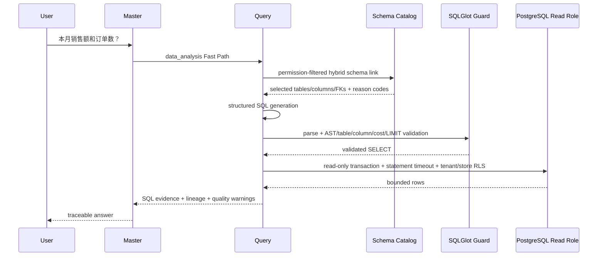
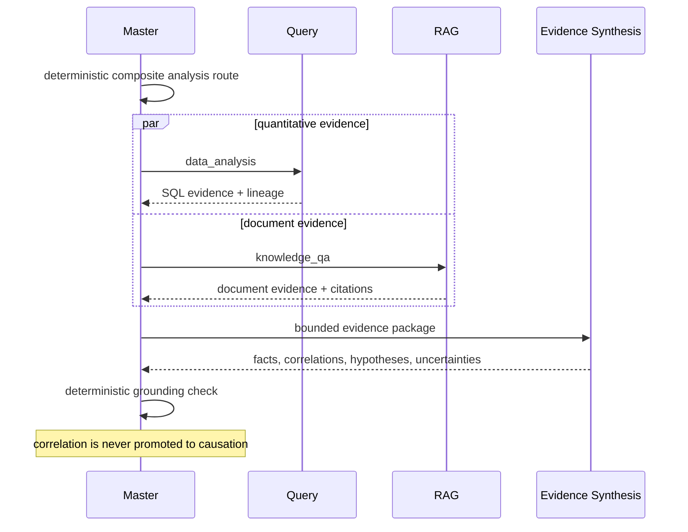
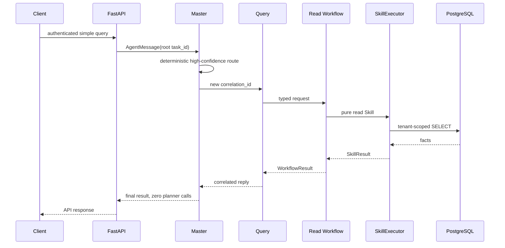
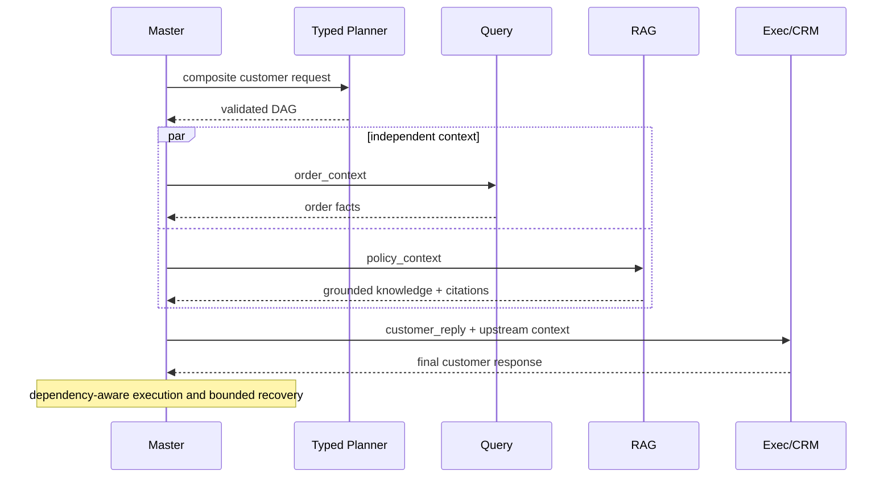
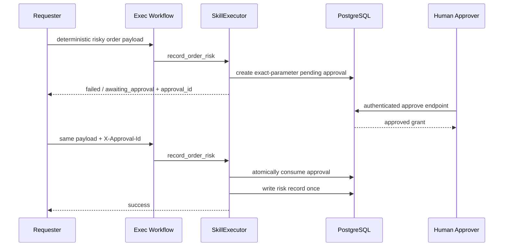

# Architecture sequences

The system has four runtime Agents. Workflows and Skills provide business variety without weakening those responsibility boundaries.

```text
User -> FastAPI -> Master -> Fast Path / Typed Planner -> Validated DAG
                              |              |              |
                            Query           RAG            Exec
                              |              |              |
                         SQL / Read API  Knowledge Base  Write API
                              +--------------+--------------+
                                             |
                                      Evidence Store
                                             |
                                  Evidence Synthesis Service
                                             |
                                      Grounding Check
```

SecurityContext, RBAC, PostgreSQL RLS, approval, idempotency, timeouts, tracing, metrics and evaluation are cross-cutting boundaries. Analysis and business APIs are services/Skills, never additional runtime Agents.

## Safe Text-to-SQL Fast Path



Generated SQL is never authorized by the model. Permission filtering occurs before generation and again at AST validation; RLS remains the final database boundary. Safe technical database errors may be repaired once, then the complete validation chain runs again. Permission, tenant, unsafe SQL and cost failures are never repaired.

## Structured + unstructured analysis



## Simple Fast Path



## Composite Typed DAG



## Risk approval



The LLM never participates in approval. Tenant identity, required scopes, parameter hashes, expiry, and one-time consumption are deterministic security controls.
