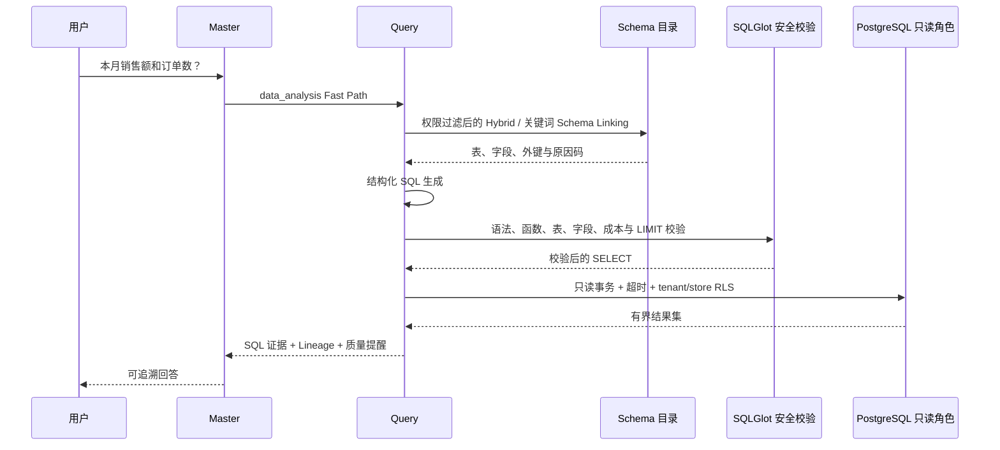
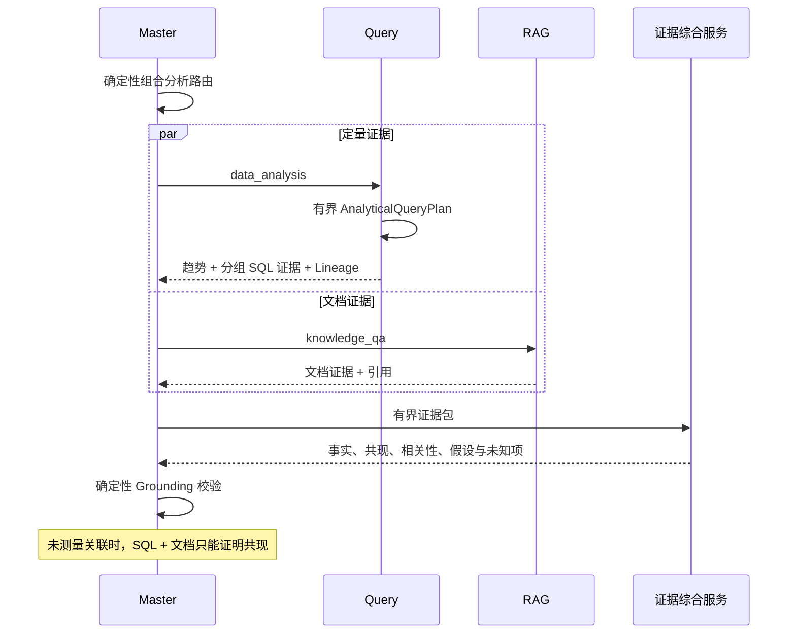
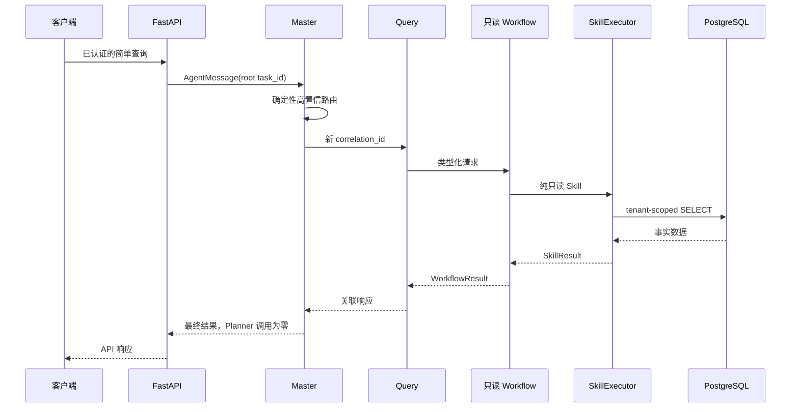
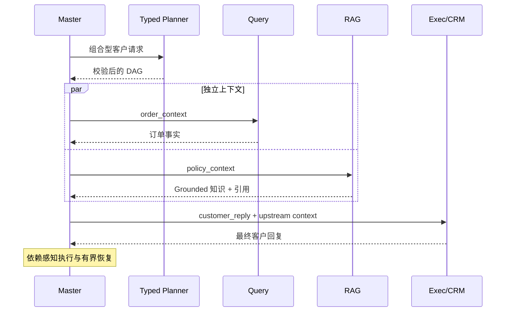
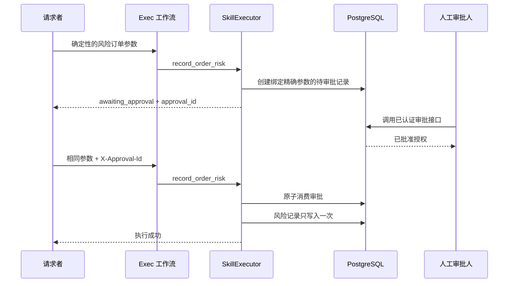

# 系统架构与关键时序

系统只有四个 Runtime Agent。丰富的业务能力由 Workflow 与 Skill 提供，不会削弱四个 Agent 的职责和安全边界。

```text
用户 -> FastAPI -> Master -> Fast Path / Typed Planner -> 已校验 DAG
                              |              |              |
                            Query           RAG            Exec
                              |              |              |
                         SQL / 只读 API    知识库       写 API
                              +--------------+--------------+
                                             |
                                         证据库
                                             |
                                       证据综合服务
                                             |
                                       Grounding 校验
```

SecurityContext、RBAC、PostgreSQL RLS、人工审批、幂等、超时、链路追踪、指标与评估构成横切安全边界。分析和业务 API 以 Service/Skill 形式存在，不会额外创建 Runtime Agent。

## 安全 Text-to-SQL Fast Path



生成 SQL 的授权永远不由模型决定。系统在生成前进行权限过滤，并在 AST 校验时再次检查；RLS 是最终数据库边界。安全的技术性数据库错误最多允许修复一次，修复后必须重新经过完整校验链；权限、租户、危险 SQL 和成本超限错误绝不自动修复。

## 结构化数据 + 非结构化知识联合分析



每个分析子查询都独立经过权限过滤的 Schema Linking、SQL 生成、Fail-closed 函数白名单、AST 校验、查询守卫、只读执行和 RLS。计划最多四步、并发最多三个，并且只能使用授权 Catalog 中真实存在的维度；如果没有地区字段，系统就不会虚构地区分析。

## 简单任务 Fast Path



## 组合任务 Typed DAG



## 高风险操作审批



LLM 永远不参与审批授权。租户身份、必要 Scope、参数哈希、有效期和一次性消费全部由确定性安全代码控制。
