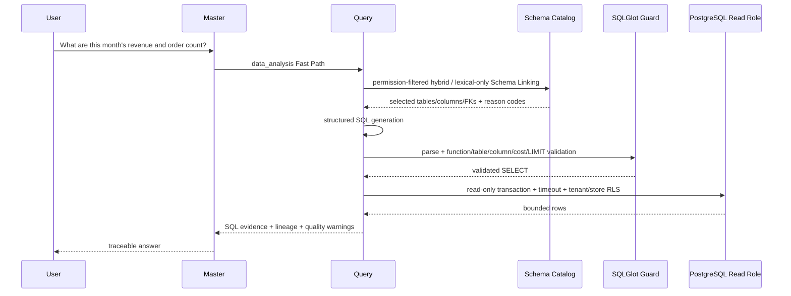
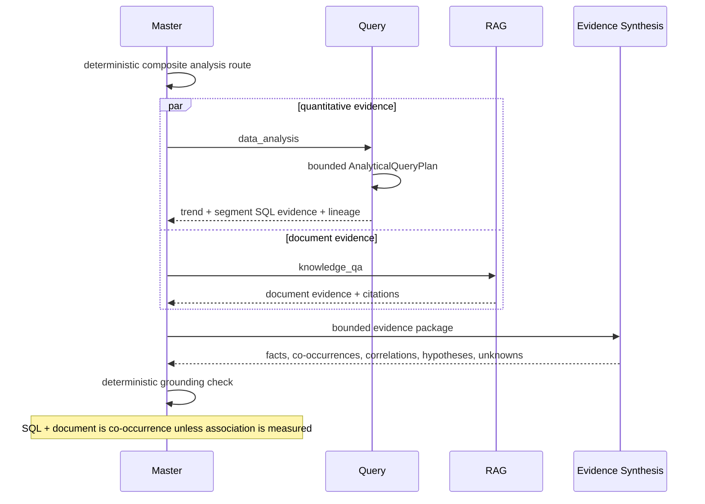
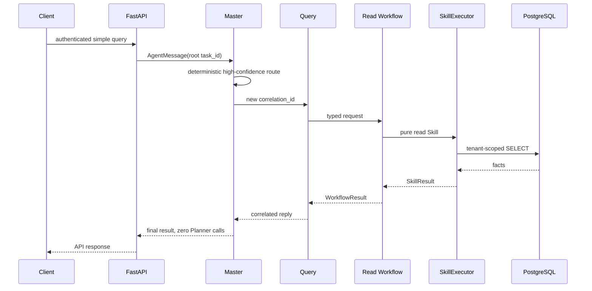
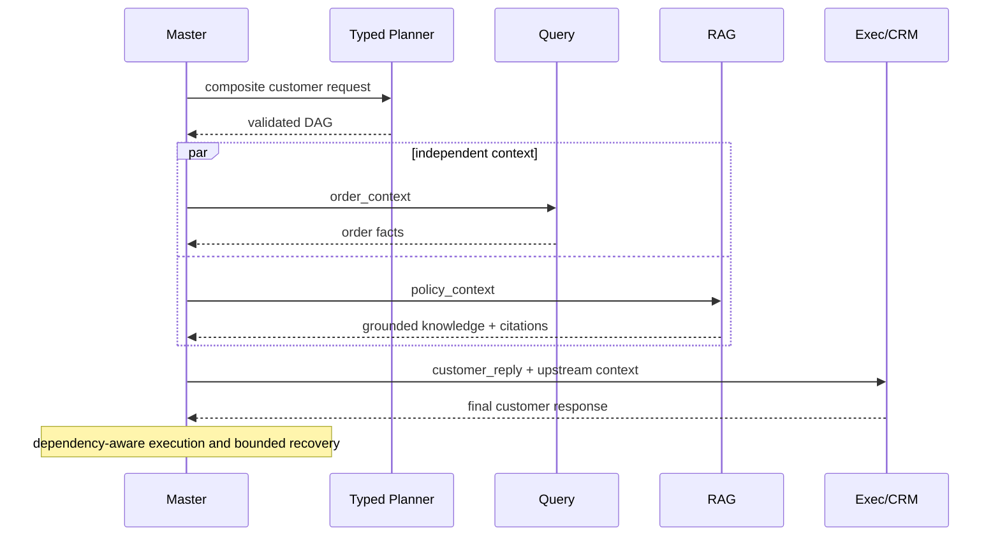
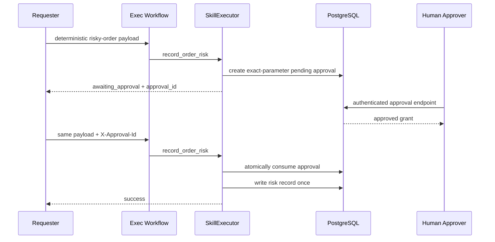

# System Architecture and Key Sequences

[简体中文](architecture.md) | [English](architecture_en.md)

The system has four Runtime Agents. Workflows and Skills provide business variety without weakening those responsibility and security boundaries.

```text
User -> FastAPI -> Master -> Fast Path / Typed Planner -> Validated DAG
                              |              |              |
                            Query           RAG            Exec
                              |              |              |
                         SQL / Read API  Knowledge Base  Write API
                              +--------------+--------------+
                                             |
                                      Evidence Store
                                             |
                                  Evidence Synthesis Service
                                             |
                                      Grounding Check
```

SecurityContext, RBAC, PostgreSQL RLS, approval, idempotency, timeouts, tracing, metrics, and evaluation are cross-cutting boundaries. Analysis and business APIs are Services/Skills, never additional Runtime Agents.

## Safe Text-to-SQL Fast Path



Generated SQL is never authorized by the model. Permission filtering occurs before generation and again during AST validation; RLS remains the final database boundary. Safe technical database errors may be repaired once, after which the full validation chain runs again. Permission, tenant, unsafe SQL, and cost failures are never repaired.

## Structured and unstructured joint analysis



Every analytical subquery independently passes permission-filtered linking, SQL generation, the fail-closed function allowlist, AST validation, query guards, read-only execution, and RLS. A plan is capped at four steps with concurrency three. It can only use dimensions present in the allowed Catalog; if a region column does not exist, region analysis cannot be planned.

## Simple Fast Path



## Composite Typed DAG



## High-risk approval



The LLM never participates in approval authorization. Tenant identity, required scopes, parameter hashes, expiry, and one-time consumption are deterministic security controls.

